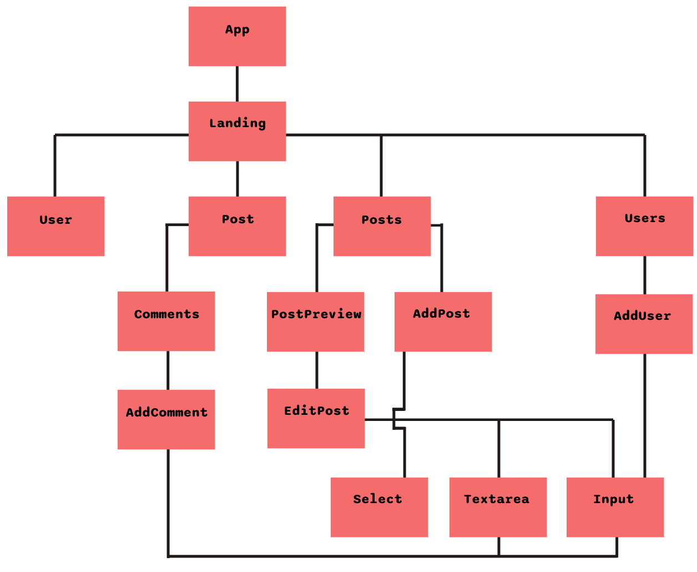

| Wydział Informatyki Politechniki Białostockiej  Przedmiot : Aplikacje internetowe oparte o komponenty | Data realizacji: 21.01.2023            |
| --------------------------------------------------------------------------------------------------------- | -------------------------------------- |
| Projekt React Adam Brzozowski                                                                             | Prowadzący: dr inż. Urszula Kużelewska |

# Architektura

Komponent **Posts** przekazuje do komponentu **PostPreview**:

- obiekt danego posta
- handler usuwania posta

Komponent **Posts** przekazuje do komponentu **AddPost**:

- handler dodawania nowego posta

Komponent **PostPreview** przekazuje do komponentu **EditPost**:

- aktualną treść oraz tytuł edytowanego posta

Komponent **Comments** przekazuje do komponentu **Comment**:

- handler dodawania nowego komentarza

Komponenty **EditPost**, **AddPost**, **AddUser**, **AddComment** przekazują do komponentów generycznych formularza połączenia z oryginalnym formularzem, walidatory, błędy, typ oraz etykietę

Komponent **Users** przekazuje do komponentu **AddUser**:

- handler dodawania nowego użytkownika

# Ścieżki i komponenty związane z routingiem

"/" : Landing 
"/posts" : Posts 
"/users" : Users 
"/posts/:id" : Post 
"/users/:id" : User 

# Redux

Store projektu przechowuje listę postów oraz listę uytkowaników pobieraną podczas pierwszego załadowania strony.
Komponenty **Posts**, **Posts** oraz **User** wykorzystują selektor postów.
**User**, **Users**, **PostPreview**, **Post** oraz **AddPost** wykorzystują selektor użytkowników.

# API serwera

Lista ścieżek i żądań:

- GET "/posts", Pobiera tablicę obiektów przedstawiających posty
- GET "/users", Pobiera tablicę obiektów przedstawiających użytkowników
- GET "/posts/:id", Pobiera pojedynczy obiekt posta o id odpowiadającym temu z parametru żądania
- POST "/posts/:id", Dodaje pozycję o treści żądania i podanym w parametrze id do tablicy postów
- PATCH "/posts/:id", Edytuje istniejącą pozycję w tablicy postów na podstawie parametru oraz treści żądania
- DELETE "/posts/:id", Usuwa post o podanym w parametrze id z tablicy
- GET "/users/:id", Pobiera pojedynczy obiekt użytkownika o id odpowiadającym temu z parametru żądania
- POST "/users/:id", Dodaje pozycję o treści żądania i podanym w parametrze id do tablicy użytkowników
- GET "/posts/:id/comments", Pobiera tablicę obiektów przedstawiających komentarze należące do posta o podanym id
- POST "/posts/:id/comments", Dodaje pozycję o treści żądania i podanym w parametrze id do tablicy komentarzy posta o danym id
- DELETE "/posts/:id/comments", Usuwa pozycję o podanym w parametrze id z tablicy komentarzy posta o danym id

# Ciekawe elementy kodu

# Wypunktowane elementy techniczne

## Weryfikacja typu danych

Korzystanie z typescripta w tym projekcie działa poprzez tworzenie interfejsów, a następnie typowanie nimi zmiennych, obiektów. 
Interfejsy tego projektu znajdują się w pliku `types.ts` skąd eksportowane są do poszczególnych komponentów.

## Własna walidacja danych wprowadzanych przez użytkownika

Formularze zostały wykonane za pomocą biblioteki **React Hook Form**. 
Inputy rejestrowane są w formularzu za pomocą metody `register()` przekazywanej do kompnentów generycznych.
Do metody register przekazywane są zasady z pliku `rules.ts`. Zawiera on obiekty opisujące walidatory formularza.

## 4 komponenty reużywalne

Komponenty Input, Select, Textarea i Button są generycznymi komponentami.

## 4 żądania HTTP

Sćieżki API projektu opisane są powyżej. W pliku Landing wywoływany jest GET na posty i użytkowników, ktorymi zaludniany jest `store`. W Post mamy GET "/post/:id/comments" pobierający komentarze pod postem. Komponenty AddPost, AddComment, AddUser wywołują żądania POST, a EditPost PATCH.

## Żądania do serwera

W pliku services.ts znajdują się funkcje pobierające dane z serwera. Eksportowane są one stamtąd do poszczególnych komponentów.

## Routing

W pliku App.tsx znajduje się definicja Routera na podstawie obiektu ze ścieżkami. Jest to obiekt przypisujący komponenty do odpowiednich ścieżek. Następnie w Landing.tsx za pomocą elementu `<Outlet>` wskazujemy miejsce w strukturze aplikacji gdzie renderować się ma odpowiedni komponent.

## Architektura FLUX

W pliku `index.tsx` znajduje się punkt wejściowy aplikacji 'owinięty' przez komponent **Provider**. Przechowuje on `store` i daje do niego dostęp wszystkim komponentom.

# Biblioteki

- axios
  https://github.com/axios/axios  
  Biblioteka stanowiąca prostego klienta HTTP dla przeglądarek. Ułatwiła ona wysyłanie żądań HTTP i odbieranie odpowiedzi.

- redux
  https://redux-toolkit.js.org/  
  Biblioteka umożliwiająca implementację architektury FLUX w projekcie.

- react-hook-form
  https://react-hook-form.com/  
  Biblioteka usprawniająca pracę z formulażami.

# Podział pracy

Wszystko - Adam Brzozowski
